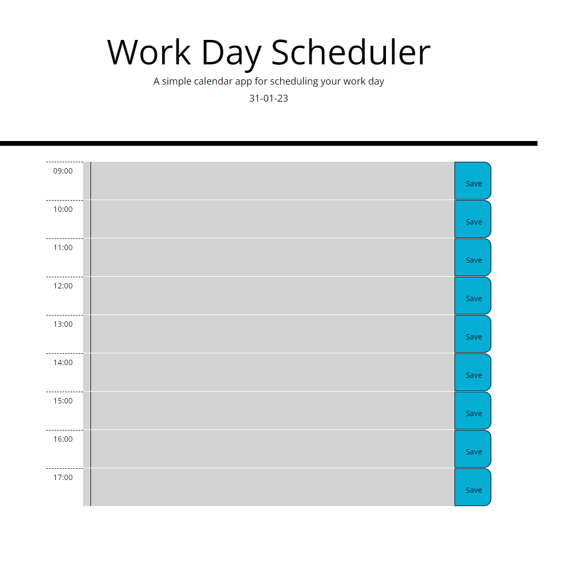

# WorkDayPlanner

## introduction
 In this week's assignment, we were tasked with creating a work day planner.

Starting with some starter code, I first used  bootstrap to add the 9 rows for each hour of the work day.One of the requirements was for the planner to be color coordinated based on past, present and future. I had used what he had been learning in lesson to save what was written in the local storage.Finally, one of the lessons last week was about moment.js which i used to generate today's date and the current time.

## Technologies
Project is created with HTML BOOTSTRAP CSS AND JQUERY

## Image of web page

## Link to live site

https://gpsnm.github.io/WorkDayPlanner/
